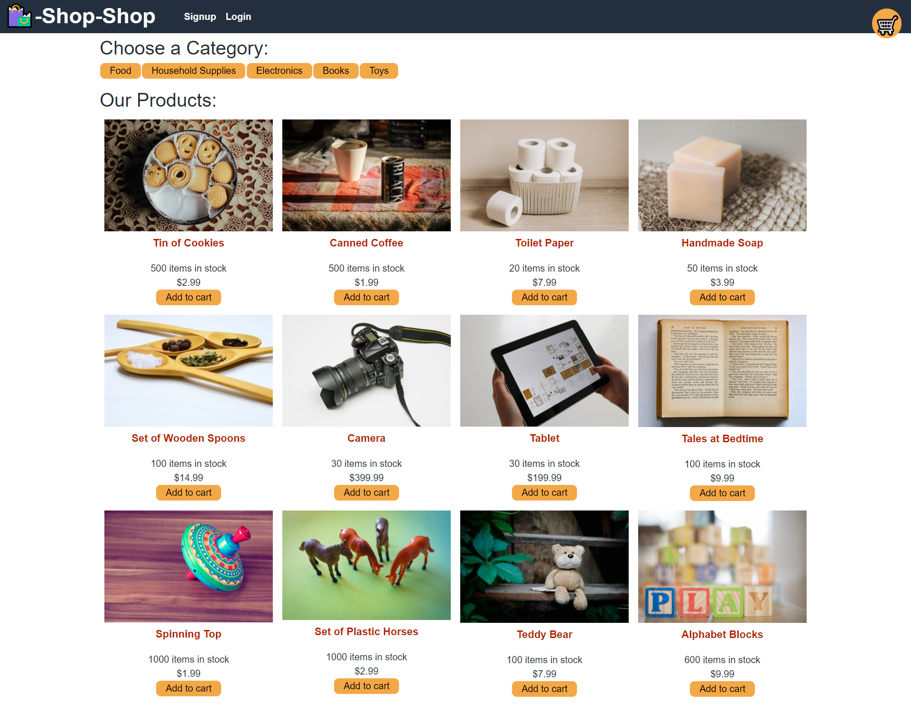

# Shop-Shop

## Description   
An e-commerce site refactored to use Redux to manage global state.

***
### Table of Contents  
1. [Screenshot](https://github.com/MLLynch2K/shop-shop#screenshot)
2. [Deployed Link](https://github.com/MLLynch2K/shop-shop#deployed-link)
3. [Features](https://github.com/MLLynch2K/shop-shop#features)
4. [Contributors](https://github.com/MLLynch2K/shop-shop#contributors)
5. [Questions](https://github.com/MLLynch2K/shop-shop#questions)   

***   
### Screenshot   
    

***
### Deployed Link     
[Shop-Shop]()   

***
### Features    
React   
Redux   

***
### Contributors  
Michele Lee Lynch

***
### Questions  
[Contact Me](https://github.com/MLLynch2K)   